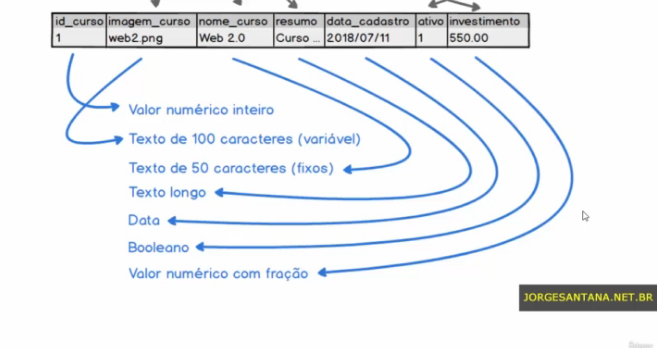
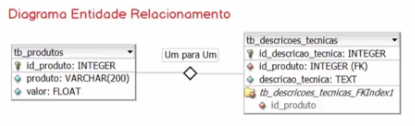
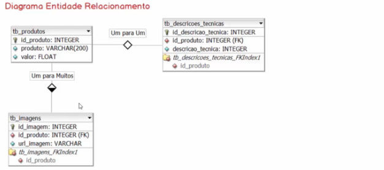
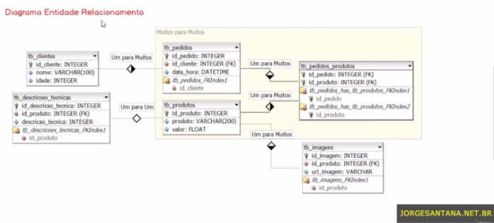
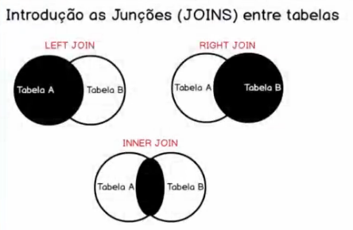

<h2>Estudando MySQL</h2>
<h3>Seção 13: Banco de Dados MySQL</h3>

Curso Desenvolvimento Web Completo 2022

## Conteúdo
     
<a href="#aula01">Aula 01: O que é MySQL?</a> 
<a href="#aula02">Aula 02: Um pouco mais sobre SQL.</a> 
<a href="#aula03">Aula 03: Utilizando o PHPMyAdmin para manipulação do MySQL.</a> 
<a href="#aula04">Aula 04: Criando e excluindo Bancos de Dados.</a> 
<a href="#aula05">Aula 05: Tabelas e tipos de dados parte 1 - Um pouco de teoria.</a> 
<a href="#aula06">Aula 06: Tabelas e tipos de dados parte 2 - Partindo para prática.</a> 
<a href="#aula07">Aula 07: Extra - Entendendo a diferença entre os tipos de dados char e varchar.</a> 
<a href="#aula08">Aula 08: Editando nome de tabelas.</a> 
<a href="#aula09">Aula 09: Incluindo, editando e removendo colunas de tabelas.</a> 
<a href="#aula10">Aula 10: INSERT - Inserindo dados em tabela.</a> 
<a href="#aula11">Aula 11: SELECT - Consultando dados.</a> 
<a href="#aula12">Aula 12: Filtrando registros (WHERE).</a> 
<a href="#aula13">Aula 13: Populando o banco de dados com registros para testes.</a> 
<a href="#aula14">Aula 14: SELECT - Filtros com Operadores de Comparação.</a> 
<a href="#aula15">Aula 15: SELECT - Filtros com Operadores Lógicos.</a> 
<a href="#aula16">Aula 16: SELECT - Filtros com o operador BETWEEN.</a> 
<a href="#aula17">Aula 17: SELECT - Filtros com o operador IN.</a> 
<a href="#aula18">Aula 18: SELECT - Filtros com o operador LIKE.</a> 
<a href="#aula19">Aula 19: SELECT - Ordenando resultado.</a> 
<a href="#aula20">Aula 20: SELECT - Limitando retorno.</a> 
<a href="#aula21">Aula 21: SELECT - Funções de agregação parte 1: MAX, MIN e AVG.</a> 
<a href="#aula22">Aula 22: SELECT - Funções de agregação parte 2: SUM e COUNT.</a> 
<a href="#aula23">Aula 23: SELECT - Agrupando seleção de registros (GROUP BY).</a> 
<a href="#aula24">Aula 24: SELECT - Filtrando seleções agrupadas (HAVING).</a> 
<a href="#aula25">Aula 25: UPDATE - Atualizando registros.</a> 
<a href="#aula26">Aula 26: DELETE - Excluindo registros.</a> 
<a href="#aula27">Aula 27: Introdução ao relacionamento entre tabelas, chave primária e estrangeira.</a> 
 

## Projeto Loja Virtual

<a href="#projeto">Sobre o Projeto.</a> 
<a href="#aula001">Aula 01: Relacionamento Um para Um.</a> 
<a href="#aula002">Aula 02: Relacionamento Um para Um (populando tabelas).</a> 
<a href="#aula003">Aula 03: Relacionamento Um para Muitos.</a> 
<a href="#aula004">Aula 04: Relacionamento Muitos para Muitos.</a> 
<a href="#aula005">Aula 05: Relacionamento Muitos para Muitos (populando tabelas).</a> 
<a href="#aula006">Aula 06: Introdução às Junções (JOINS) entre tabelas.</a> 
<a href="#aula007">Aula 07: JOIN - Junção à esquerda (LEFT JOIN).</a> 
<a href="#aula008">Aula 08: JOIN - Junção à direita (RIGHT JOIN).</a> 
<a href="#aula009">Aula 09: JOIN - Junção interna (INNER JOIN).</a> 
<a href="#aula010">Aula 10: Alias - Apelidando tabelas.</a> 
<a href="#aula011">Aula 11: Considerações finais e Atividades extra.</a> 

<h2>Aula 01: O que é MySQL?</h2>

É um `Sistema Gerenciador de Banco de Dados (SGBD)` Relacional, **gratuito**, que utiliza a **linguagem SQL** (Structured Query Language ou Linguagem de Consulta Estruturada) para **definir, manipular, controlar, transacionar e recuperar dados**.

Funciona como uma `interface entre as aplicações e os dados`, sendo o seu principal objetivo: controlar o acesso à manipulação e à organização dos dados persistido nos servidores de dados .

Basicamente, o SGBD fornece uma API para as aplicações, para que tenham acesso aos dados persistidos no servidor, sendo essa comunicação realizada entre as aplicações e o SGBD feita através da linguagem SQL!

Banco de Dados consistem em estruturas de dados organizadas em tabelas, que contém os registros, e esses registros estão relacionados entre essas tabelas.

<a href="#conteudo">Voltar ao topo.</a> 

<h2>Aula 02: Um pouco mais sobre SQL.</h2>

A `Linguagem SQL` é adotada como linguagem padrão nos principais BDs relacionais presentes no mercado, como MySQL, PostgreSQL, SQLServer e ORACLE. 

É a linguagem responsável por definir, manipular, controlar, transacionar e recuperar dados junto ao SGBD.

Pode ser dividida em cinco subcategorias e instruções com objetivos específicos:

1. DDL - Data Definition Language 
    - Linguagem de definição de dados. 
    - permite implementar a modelagem de dados - criar, alterar e remover estruturas de dados.

2. DML - Data Manipulation Language 
    - Linguagem de Manipulação de Dados.
    - Permite inclusão, alteração e remoção dos registros dentro das estruturas de dados.

3. DCL - Data Control Language 
    - Linguagem de Controle de Dados.
    - Possibilita gerenciar acesso por parte de usuários externos ao SGBD.

4. DTL - Data Transaction Language 
    - Linguagem de Transação de Dados.
    - Permite efetivar ou cancelar as transações junto ao SGBD.

5. DQL - Data Query Language 
    - Linguagem de Consulta de Dados 
    - permite recuperar dados através do estabelecimento de cláusulas, de operações lógicas, relacionais ou de funções de agragação.

<a href="#conteudo">Voltar ao topo.</a> 

<h2>Aula 03: Utilizando o PHPMyAdmin para manipulação do MySQL.</h2>

`PHPMyAdmin` é uma aplicação web, escrita em PHP, que serve para acessar e administrar o Banco de Dados MySQL. **É uma interface para o SGBD do MySQL**, acessada através do navegador/browser.

### Como acessar PHPMyAdmin?

1. Acessar o XAMPP.
2. Subir/startar o serviço do Apache (Start) - Porta 80.
3. Subir/startar o serviço do MySQL (Start) - Porta 3306.
4. Acessar no navegador: `localhost/phpmyadmin`.

### Apresentação do PHPMyAdmin:

- Na barra à esquerda, há a relação dos BDs existentes em nosso computador e gerenciado pelo SGBD do MySQL.
- À direita, informações a respito do servidor do BD e do servidor web, e alguns links para documentação e informações do PHPMyAdmin.

> No curso, trabalhamos com MariaDB, uma extensão do MySQL, uma branch open source!

<a href="#conteudo">Voltar ao topo.</a> 

<h2>Aula 04: Criando e excluindo Bancos de Dados.</h2>

Bancos de dados são coleções organizadas de dados, que se relacionam de algum modo; consiste em agrupar registros de um domínio específico.

***Não existe um jeito certo e único de se criar um banco de dados***; depende do nível de abstração do assunto!

 

### No PHPMyAdmin:

Há duas formas de trabalho, disponíveis em qualquer client que se comunique com um SGBD:
1. instruções SQL.
2. através de interface gráfica.

 

### Instruções/Comandos SQL:

A) Para criar um BD (DDL): 

1. Comando `CREATE DATABASE nome_do_bd`. Exemplo:

~~~sql
CREATE DATABASE db_curso_web;
~~~

**Importante:** não utilizar caracteres especiais ou espaços quando for definir o nome do BD.

2. Clicar em Executar/Continuar.

 

B) Para remover um BD (DDL): 

1. Comando `DROP DATABASE nome_do_bd`. Exemplo:

~~~sql
DROP DATABASE db_curso_web;
~~~

2. Clicar em Executar/Continuar.

**Importante:** cuidado com os demais bancos de dados, porque contém informações importantes para o gerenciamento do próprio MySQL! Com exceção do banco de dados "test", evitar mexer nos demais BDs.

 

### Interface visual:

 

Para criar um BD:
1. Clicar em New/Novo.
2. Inserir o nome do BD.
3. Clicar em Criar.

Para excluir um BD:
1. Menu Operações.
2. Clicar em "Apagar a Base de Dados".

<a href="#conteudo">Voltar ao topo.</a> 

<h2>Aula 05: Tabelas e tipos de dados parte 1 - Um pouco de teoria.</h2>

### Tabelas:

- Estruturas "semelhantes" a planilhas.
- Podem ser entendidas como unidades de armazenamento.
- São construídas com um número **finito de colunas**, e número **indefinido de linhas**!
- As informações cadastradas em aplicações são processados por uma linguagem de programação (como PHP) e, posteriormente, os dados processados podem ser inseridos como novos registros dentro de tabelas em BDs.
- São repositórios que qualificam os atributos de cada registro armazenado! Ou seja, além dos dados propriamente ditos de cada registro, associa metadados (como tipos e subtipos), que podem ser usados para controlar a integridade da informação ou otimizar pesquisas.

### Tipos de dados:

- Importantes para a definição de tabelas.
- Cada coluna de uma tabela é responsável pelo armazenamento de um tipo de dado específico, que deve ser definido no momento de criação da tabela!
- Exemplo:

 

- Alguns dos principais tipos de dados (e seus subtipos) são:

a) Campos de texto:

- `text`: tamanho variável que armazena uma grande quantidade de caracteres.
- `varchar`: tamanho variável que armazena de 0 até 255 caracteres (descrições textuais mais curtas).
- `char`: tamanho fixo que armazena de 0 até 255 caracteres.

b) Campos numéricos:

- `int`: valores numéricos inteiros, tanto positivos quanto negativos.
- `float`: valores numéricos fracionados, tanto positivos quanto negativos.

c) Campos de data e hora:

- `date`: data no formato YYYY/mm/dd.
- `time`: hora.
- `datetime`: combinação entre date e time em um mesmo campo.

> Indicar o tipo de campo corretamente permite trabalhar com funções nativas do SGBD!

<a href="#conteudo">Voltar ao topo.</a> 

<h2>Aula 06: Tabelas e tipos de dados parte 2 - Partindo para prática.</h2>

Objetivo: criar uma tabela que receba registros de cursos (DDL).

Ao acessar o PHPMyAdmin, há duas opções para criar a tabela: através da interface visual ou da Linguagem SQL.

1. através da interface: 

- para criar uma tabela:
    - clicar no BD;
    - definir o nome da tabela;
    - inserir n°,. de colunas;
    - definir o nome de cada uma das colunas e os tipos de dados (**obs: none é o oposto de null**);
    - clicar em "Guardar".

- para remover uma tabela:
    - clicar sobre a tabela;
    - menu operações;
    - opção "delete the table".

 
2. através da linguagem SQL: 

- para criar uma tabela:

~~~sql
CREATE TABLE tb_cursos (
    id_curso int not null,
    imagem_curso varchar(100) not null,
    nome_curso char(50) not null,
    resumo text null,
    data_cadastro datetime not null,
    ativo boolean default true,
    investimento float(5, 2) default 0
);

/*float(n° dígitos, qtdd dígitos correspondentes à fração)*/
~~~

- para excluir uma tabela:

~~~sql
DROP TABLE tb_cursos;
~~~

<a href="#conteudo">Voltar ao topo.</a> 

<h2>Aula 07: Extra - Entendendo a diferença entre os tipos de dados char e varchar.</h2>

1. CHAR:

- tamanho **fixo** em disco.
- todos os espaços relativos à quantidade de caracteres definidos ficam reservados no disco, independente de inserirmos ou não textos com este número de caracteres.
- vantagem: mais rápido para pesquisas.
- desvantagem: quanto mal utilizdo, pode reservar espaço em disco de forma desnecessária.

2. VARCHAR:

- tamanho **variável** em disco.
- possui a inteligência de reservar apenas a quantidade de caracteres utilizados para aquela string (ocupa menos espaço no BD).
- vantagem: por ser de tamanho variável, ocupa apenas o espaço necessário em disco.
- desvantagem: por ser de um tamanho variável, possui um metadado com uma instrução de finalização do texto, o que produz, em relação ao CHAR, maior lentidão em pesquisas.

Exemplo:
- Dado: MONICA
- Char (10 posições): M O N I C A _ _ _ _
- Varchar (10 posições): M O N I C A

<a href="#conteudo">Voltar ao topo.</a> 

<h2>Aula 08: Editando nome de tabelas.</h2>

a) Utilizando recursos viduais:
- selecionar a tabela;
- clicar em operações;
- em "opções da tabela", na opção "renomeie a tabela para", inserir o novo nome;
- clicar em Executar/Continuar.

b) Intrução DDL do MySQL:
~~~sql
RENAME TABLE <nome_atual> TO <nome_novo>;
/* em seguida, atualizar a aplicação (botão Reload)!
~~~

<a href="#conteudo">Voltar ao topo.</a> 

<h2>Aula 09: Incluindo, editando e removendo colunas de tabelas.</h2>

### 1. Através da interface visual:

a) Incluindo colunas:
- clicar no botão que expande os recursos da tabela.
- expendir as opções de colunas.
- clicar em "New".
- inserir os dados da nova Coluna.
- clicar em Guardar.

b) Editando a coluna:
- clicar no nome da tabela;
- em Estrutura, clicar na opção "Muda" da coluna que queremos alterar (ou diretamente pela lista de colunas no menu esquerdo);
- fazer a alteração e clicar em "Guardar".

c) Deletando coluna:
- clicar no nome da tabela;
- em Estrutura, clicar na opção "Eliminar" da coluna que queremos excluir (ou diretamente pela lista de colunas no menu esquerdo);
- clicar em Ok.

 

### 2. Linguagem SQL:

Sintaxe:
~~~sql
ALTER TABLE <comando>;
~~~

- `ADD`: permite a inclusão de uma nova coluna em uma tabela.
- `CHANGE`: permite a alteração do nome de uma coluna e de suas propriedades, como o tipo.
- `DROP`: permite a remoção de uma coluna da tabela.

a) Inclusão de coluna:

~~~sql
ALTER TABLE nome_da_tabela ADD COLUMN nome_da_coluna <TIPO_DE_DADO> <PARÂMETRO>;
~~~

b) Alteração de coluna:

~~~sql
ALTER TABLE nome_da_tabela CHANGE nome_da_coluna <DADOS_A_SEREM_MODIFICADOS>;

/* caso queira modificar o nome: */
ALTER TABLE nome_da_tabela CHANGE nome_antigo_da_coluna novo_nome_da_coluna <DEMAIS_DADOS_A_MODIFICAR>;

/* caso queira manter o nome: */
ALTER TABLE nome_da_tabela CHANGE nome_da_coluna nome_da_coluna <DADOS_A_SEREM_MODIFICADOS>;

/* se mudarmos apenas o nome, ainda assim devemos indicar o tipo na sequência, sem precisas do parâmetro!*/
~~~

c) Exclusão de coluna:

~~~sql
ALTER TABLE nome_da_tabela DROP nome_da_coluna;
~~~

<a href="#conteudo">Voltar ao topo.</a> 

<h2>Aula 10: INSERT - Inserindo dados em tabela.</h2>

### 1. Através da interface visual:
- clicar no BD e tabela desejados;
- clicar em "Inserir";
- preencher o formulário com os dados;
- clicar em "Executar".
- clicando na tabela, poderemos verificar os registros realizados.

 

### 2. Linguagem SQL:

~~~sql
INSERT INTO nome_da_tabela (coluna1, coluna2, coluna3) VALUES (valor_col1, valor_col2, valor_col3);
~~~

<a href="#conteudo">Voltar ao topo.</a> 

<h2>Aula 11: SELECT - Consultando dados.</h2>

Como recuperar os registros inseridos? (DML)

### 1. Através da interface visual:
- basta clicar sobre a tabela!

 

### 2. Linguagem SQL:

~~~sql
SELECT <colunas> FROM <tabela>;
~~~

Podemos utilizar o `caractere coringa: *` para selecionar todos os campos da tabela, como a seguir:

~~~sql
SELECT * FROM <tabela>;
~~~

Atentar-se ao tamanho do BD e quantidade de dados antes de utiliza-lo - verificar se vale a pena!

<a href="#conteudo">Voltar ao topo.</a> 

<h2>Aula 12: Filtrando registros (WHERE).</h2>

Como utilizar filtros para limitar as consultas, atualizações e remoções de registros?
- filtros permitem especificar o que queremos obter em um BD, especificam quais condições devem ser satisfeitas.
- também permitem transformar uma relação de registros em informação!

Exemplo:

~~~sql
SELECT <coluna> FROM <tabela> WHERE <condição>;

/* Caso queira selecionar mais ade uma coluna: */
SELECT <colunas> FROM <tabela> WHERE <condição> AND <condição>;
~~~

***Importante:***

a) Operadores de comparação:

Operador | Função
---------|---------
= | Valor da esquerda igual ao da direita
&lt; | Valor da esquerda menor que o da direita
&lt;= | Valor da esquerda menor ou igual ao da direita
&gt; | Valor da esquerda maior que o da direita
&lt;= | Valor da esquerda maior ou igual ao da direita

b) Operadores lógicos:

Operador | Função
---------|---------
AND | Todas as operações de comparação devem ser verdadeiras
OR | Pelo menos 1 das condições de operação deve ser verdadeira.

<a href="#conteudo">Voltar ao topo.</a> 

<h2>Aula 13: Populando o banco de dados com registros para testes.</h2>

Para preencher o BD demonstrado em aula, o prof. gerou dados aleatórios através do site [Generate Data](https://generatedata.com/).

E, para inserir diversos dados simultaneamente, exemplo:

~~~sql
INSERT INTO `tabela` (`col1`,`col2`,`col3`) VALUES (1,"Jorden",47), (2,"Lacey",59), (3,"Lillith",48);
/* syntax sugar*/
~~~

Obs: "syntax sugar" = sintaxe dentro da linguagem que tem por finalidade tornar suas construções mais fáceis de serem lidas e expressas.

<a href="#conteudo">Voltar ao topo.</a> 

<h2>Aula 14: SELECT - Filtros com Operadores de Comparação.</h2>

Como consultar os registros dentro das tabelas de forma mais avançada? Utilizar operadores de comparação para filtrar registros!

***Operar apenas com linguagem SQL*** (geralmente não há recursos de seleção avançada através da interface visual)!

### Exemplo:

~~~sql
SELECT
  id_curso, nome_curso 
FROM 
  `tb_cursos` 
WHERE 
  investimento < 500.00;
~~~

### Operadores de Comparação

Operadores | Função
:---------:|---------
= | Valor da esquerda igual ao valor da direita
&lt; | Valor da esquerda menor que o valor da direita
&lt;= | Valor da esquerda menor ou igual ao valor da direita
&gt; | Valor da esquerda maior que o valor da direita
&gt;= | Valor da esquerda maior ou igual ao valor da direita

<a href="#conteudo">Voltar ao topo.</a> 

<h2>Aula 15: SELECT - Filtros com Operadores Lógicos.</h2>

Operadores lógicos combinam resultados de operadores de comparação.

### Operadores Lógicos

Operadores | Função
:---------:|---------
AND | Todas as operações de comparação devem ser verdadeiras
OR | Pelo menos uma das operações de comparação deve ser verdadeira

### Exemplo:

~~~sql
SELECT
	* 
FROM 
	`tb_alunos` 
WHERE 
	interesse = 'Jogos' AND idade >= 30;
~~~

<a href="#conteudo">Voltar ao topo.</a> 

<h2>Aula 16: SELECT - Filtros com o operador BETWEEN.</h2>

O operador `BETWEEN` é utilizado quando precisamos filtrar registros cujo valor de determinada coluna encontra-se em um intervalo específico (number ou date).

~~~sql
SELECT
	* 
FROM 
	`tb_alunos` 
WHERE 
	idade BETWEEN  18 AND 21;
~~~

<a href="#conteudo">Voltar ao topo.</a> 

<h2>Aula 17: SELECT - Filtros com o operador IN.</h2>

O operador `IN` é utilizado para filtrar registros com base na especificação de uma lista de possibilidades.

Exemplo:

~~~sql
SELECT
	* 
FROM 
	`tb_alunos` 
WHERE 
	interesse = 'Jogos' OR interesse = 'Música' OR interesse = 'Esportes';

/* utilizando o operador IN: */

SELECT
	* 
FROM 
	`tb_alunos` 
WHERE 
	interesse IN ('Jogos', 'Música', 'Esportes');
~~~

Há também a possibilidade de utilizar `NOT IN`:

~~~sql
SELECT
	* 
FROM 
	`tb_alunos` 
WHERE 
	interesse NOT IN ('Jogos', 'Música', 'Esportes');
~~~

<a href="#conteudo">Voltar ao topo.</a> 

<h2>Aula 18: SELECT - Filtros com o operador LIKE.</h2>

O operador `LIKE` permite realizar filtros com base em uma pesquisa de um conjunto de caracteres dentro de uma coluna textual.

O operador LIKE travalha com dois caracteres coringas:
- `%`: indica que pode haver a existência de qualquer conjunto de caracteres no texto.
- `_`: indica que pode haver um ou mais caracteres em uma posição específica do texto. É mais exato que o %, pois refere-se a uma posição definida!

Podemos combinar os dois coringas também!

Exemplo:

~~~sql
SELECT
	* 
FROM 
	`tb_alunos` 
WHERE 
	nome = 'Evelyn';
~~~

Aplicando o operador IN:

~~~sql
SELECT
	* 
FROM 
	`tb_alunos` 
WHERE 
	nome LIKE 'Evelyn';
~~~

Utilizando caracteres coringa:

~~~sql
SELECT * FROM `tb_alunos`: 

WHERE 
  nome LIKE '%e';
/* qualquer conjunto de caracteres que finalize com a letra E */

WHERE
  nome LIKE '%a%';
/* pesquisa ocorrência do char "a", começando e terminando com qqr caractere */

WHERE
  nome LIKE '_riel';
/* pesquisa palavra com UM caractere desconhecido à esq. */

WHERE
  nome LIKE 'I__';
/* pesquisa palavra que inicia com I e tem 2 caracteres indef. à dir. */
~~~

<a href="#conteudo">Voltar ao topo.</a> 

<h2>Aula 19: SELECT - Ordenando resultado.</h2>

Como podemos ordenar os resultados das consultas? Utilizaremos a instrução/palavra reservada `ORDER BY`.

A construção de uma query (consulta) possui uma estrutura, como representado a seguir:

~~~sql
SELECT
  <coluna(s)>
FROM
  <tabela(s)>
WHERE /* opcional */
  <filtro(s)>
ORDER BY /* opcional */
  <categoria1> ASC, <categoria2> DESC;
~~~

Sendo os pivôs de ordenação de resultados:

- `ASC`: Ascending (ascendente). É o default, caso não coloquemos a informação de ASC ou DESC!
- `DESC`: Descending (descendente).

<a href="#conteudo">Voltar ao topo.</a> 

<h2>Aula 20: SELECT - Limitando retorno.</h2>

 O `LIMIT` é um recurso que limita a quantidade de registros informados, no momento de retorno da consulta; é geralmente usado quando há muitos registros e queremos limitar a quantidade de registros que serão exibidos ao usuário final, como em paginações.

Exemplo da aplicação:

~~~sql
SELECT
  <coluna(s)>
FROM
  <tabela(s)>
WHERE
  <filtro(s)>
ORDER BY 
  <ordenação>
LIMIT 
  5
OFFSET
  2 
~~~

Importante:

- o `LIMIT` é opcional; coloca-lo sempre ao final da query!
- o `OFFSET` pode ser usado apenas quando o LIMIT é declarado (depende dele, embora também seja opcional)! Ele funciona como um deslocamento, podendo ser definido de 2 formas:

~~~sql
<...>
LIMIT 
  5
OFFSET
  2 
~~~

ou: 

~~~sql
<...>
LIMIT
    2, 5
/* 2 = OFFSET e 5 = LIMIT */
/* SINTAXE: VALOR_OFFSET, VALOR_LIMIT*/
~~~

Quando definimos o ***OFFSET***, serão retornados os registros a partir de seu valor:
- Exemplo: em OFFSET = 4, retornará os dados a partir do 4° registro - incluindo o valor do 4° registro)!
- É MUITO IMPORTANTE lembrar que, no BD, o primeiro registro ocupará a posição 0 (zero)!

<a href="#conteudo">Voltar ao topo.</a> 

<h2>Aula 21: SELECT - Funções de agregação parte 1: MAX, MIN e AVG.</h2>

Resolvem problemas que são corriqueiros no dia-a-dia.

Sintaxe:

~~~sql
SELECT
  <funções_de_agregação>
FROM
  <tabela(s)>
WHERE
  <filtro(s)>
~~~ 

Sendo:

1. `MIN(<coluna>)`: retorna o **menor** valor de todos os registros com base em uma coluna.

2. `MAX(<coluna>)`: retorna o **maior** valor de todos os registros com base em uma coluna.

3. `AVG(<coluna>)`: retorna a **média** de todos os registros com base em uma coluna.

> A operação `TRUNCATE <tabela>` limpa todos os registros existentes dentro da tabela!!!

<a href="#conteudo">Voltar ao topo.</a> 

<h2>Aula 22: SELECT - Funções de agregação parte 2: SUM e COUNT.</h2>

Sintaxe:

~~~sql
SELECT
  <funções_de_agregação>
FROM
  <tabela(s)>
WHERE
  <filtro(s)>
~~~ 

Sendo:

1. `SUM(<coluna>)`: retorna a **soma** dos valores de todos os registros com base em uma coluna.

2. `COUNT(*)`: retorna a **quantidade** de todos os registros de uma tabela.

<a href="#conteudo">Voltar ao topo.</a> 

<h2>Aula 23: SELECT - Agrupando seleção de registros (GROUP BY).</h2>

A instrução `GROUP BY` agrupa os registros com base em uma ou mais colunas cujos valores sejam iguais. Permite realizar funções de agregação em cada subconjunto agrupado de registros. 

É muito utilizado em conjunto com funções de agregação!

Está posicionado em um local espefífico da construção da query (após FROM ou WHERE, e sempre antes de ORDER BY E LIMIT, quando utilizados).

Sintaxe:

~~~sql
SELECT
  <coluna(s)>
FROM
  <tabela(s)>
WHERE
  <filtro(s)>
GROUP BY
 <agrupamento>
ORDER BY 
  <ordenação>
LIMIT
  <offset>, <limit>
~~~ 

<a href="#conteudo">Voltar ao topo.</a> 

<h2>Aula 24: SELECT - Filtrando seleções agrupadas (HAVING).</h2>

A instrução `HAVING` serve para aplicar filtros aos resultados de colunas agrupadas (HAVING não vive sem  GROUP BY, mas o contrário não é obrigatório!)!

Sintaxe:

~~~sql
SELECT
  <coluna(s)>
FROM
  <tabela(s)>
WHERE
  <filtro(s)>
GROUP BY
 <agrupamento>
HAVING
  <filtros_sobre_resultado_do_agrupamento>
ORDER BY 
  <ordenação>
LIMIT
  <offset>, <limit>
~~~ 

Observação: no MySQL podemos utilizar `!=` ou `<>` para indicar "diferente".

<a href="#conteudo">Voltar ao topo.</a> 

<h2>Aula 25: UPDATE - Atualizando registros.</h2>

Como atualizar registros contidos dentro de tabelas em nossos BDs?

A instrução `UPDATE` faz parte do DML, ou seja, instrução de manipulação de dados.

~~~sql
UPDATE
  <tabela>
SET
  <coluna> = <valor> , <coluna> = <valor>
WHERE
  <filtro(s)>
~~~

O **WHERE** especifica qual o registro ou conjunto de registros que serão afetados pela instrução de atualização!

<a href="#conteudo">Voltar ao topo.</a> 

<h2>Aula 26: DELETE - Excluindo registros.</h2>

A instrução `DELETE` faz parte do subconjunto de instruções DML, ou seja, mais um comando para manipulação de dados.

Sintaxe:

~~~sql
DELETE FROM
  <tabela>
WHERE
  <filtro(s)>
~~~

> ***IMPORTANTE:*** caso o WHERE seja omitido (não esteja presente no comando DELETE), ***TODOS*** os registros da tabela serão removidos!!!

Caso tenha dúvidas sobre quais registros serão afetados pelo DELETE, podemos ***simular a pesquisa*** clicando no botão na parte inferior da tela!!!

Um detalhe interessante é que geralmente os registros não são removidos. Normalmente, opta-se por fazer a atualização no registro, modificando alguma coluna que indique seu estado (ativo/inativo). Geralmente são mantidos para fins de log/histórico.

<a href="#conteudo">Voltar ao topo.</a> 

<h2>Aula 27: Introdução ao relacionamento entre tabelas, chave primária e estrangeira.</h2>

O `relacionamento entre tabelas` consiste em tentar imitar a relação entre as coisas que existem no mundo real.

Há ***três tipos*** de relacionamentos possíveis entre tabelas:

- um para um:
- um para muitos:
- muitos para muitos: 

A `chave primária` serve como identificador único para cada registro de uma tabela, de modo que esse identificador não se repita em momento algum para nenhum outro registro. 
- É muito utilizada para seleção, atualização, remoção de registros e criação de relacionamentos consistentes entre tabelas. 
- Pode ser uma chave composta, quando é composta por 2 ou mais campos.

Já a `chave estrangeira`, é uma referência à chave primária de outra tabela! 

<h2>Projeto Loja Virtual</h2>
<h3>Seção 13: Banco de Dados MySQL</h3>

Curso Desenvolvimento Web Completo 2022

## O Projeto

Continuidade do estudo de relacionamento entre tabelas e, em paralelo, desenvolvimento do Projeto Loja Virtual.

O projeto consiste na criação de uma estrutura de dados que suporte uma aplicação com proposta de venda de produtos pela internet.

## Conteúdo
     
<a href="#aula001">Aula 01: Relacionamento Um para Um.</a> 
<a href="#aula002">Aula 02: Relacionamento Um para Um (populando tabelas).</a> 
<a href="#aula003">Aula 03: Relacionamento Um para Muitos.</a> 
<a href="#aula004">Aula 04: Relacionamento Muitos para Muitos.</a> 
<a href="#aula005">Aula 05: Relacionamento Muitos para Muitos (populando tabelas).</a> 
<a href="#aula006">Aula 06: Introdução às Junções (JOINS) entre tabelas.</a> 
<a href="#aula007">Aula 07: JOIN - Junção à esquerda (LEFT JOIN).</a> 
<a href="#aula008">Aula 08: JOIN - Junção à direita (RIGHT JOIN).</a> 
<a href="#aula009">Aula 09: JOIN - Junção interna (INNER JOIN).</a> 
<a href="#aula010">Aula 10: Alias - Apelidando tabelas.</a> 
<a href="#aula011">Aula 11: Considerações finais e Atividades extra.</a> 

<h2>Aula 01: Relacionamento Um para Um.</h2>

Inicialmente, serão criadas duas tabelas:
- `tb_produtos`: armazena a descrição do produto e seu valor.
- `tb_descricoes_tecnicas`: armazena a descrição técnica de cada produto.

No Diagrama de Entidade Relacionamento, temos:

 

 
<em>Elaborado com <a href="http://fabforce.eu/dbdesigner4/downloads.php">DB Designer 4</a></em>

 

Neste caso, observamos que UM produto terá como correspondente UMA especificação técnica (Relacionamento Um para Um). Além disso, temos a chave primária id_produto (de tb_produtos) sendo importada para (tb_descricoes_tecnicas), ou seja, chave estrangeira.

### No MySQL:

1. Criação do novo Banco de Dados:

~~~sql
CREATE DATABASE db_loja_virtual;
~~~

2. Criando a tabela de produtos:

~~~sql
CREATE TABLE tb_produtos (
  id_produto INT NOT NULL PRIMARY KEY AUTO_INCREMENT,
  produto VARCHAR(200) NOT NULL,
  valor FLOAT(8,2) NOT NULL
);
~~~

> ***Importante:*** inserindo `PRIMARY KEY`, fará com que o SGBD impeça a inserção de valores duplicados na chave primária id_produto! Além disso, `AUTO_INCREMENT` faz com que o próprio SGBD crie campos gerenciados por ele, de modo que, ao inserir novo registro, a informação atribuída pelo BD será o valor anteriormente inserido + 1 (vai incrementando)!

3. Criando a tabela de descrições técnicas:

~~~sql
CREATE TABLE td_descricoes_tecnicas (
  id_descricao_tecnica INT NOT NULL PRIMARY KEY AUTO_INCREMENT,
  id_produto INT NOT NULL,
  descricao_tecnica TEXT NOT NULL ,
  FOREIGN KEY(id_produto) REFERENCES tb_produtos(id_produto)
)
~~~

> ***Importante:*** a instrução `FOREIGN KEY()` recebe como parâmetro o nome da coluna que será usada nesta tabela como chave estrangeira, e na sequência, sua referência (de onde vem e para onde vai), através da palavra reservada REFERENCES.

<a href="#conteudo">Voltar ao topo.</a> 

<h2>Aula 02: Relacionamento Um para Um (populando tabelas).</h2>

Nesta aula, serão inseridos registros nas tabelas (populando-as).

Começar os INSERTs pela tabela tb_produtos, pois tb_descricoes_tecnicas depende da existência da chave estrangeira!

~~~sql
/* em tb_produtos */

INSERT INTO tb_produtos(produto, valor) VALUES ('Notebook Dell Inspiron Ultrafino Intel Core i7, 16GB RAM e 240GB SSD', 3500.00);

INSERT INTO tb_produtos(produto, valor) VALUES ('Smart TV LED 40" Samsung Full HD 2 HDMI 1 USB Wi-Fi Integrado', 1475.54);

INSERT INTO tb_produtos(produto, valor) VALUES ('Smartphone LG K10 Dual Chip Android 7.0 4G Wi-Fi Câmera de 13MP', 629.99);
~~~

~~~sql
/* em tb_descricoes_tecnicas */

INSERT INTO tb_descricoes_tecnicas(id_produto, descricao_tecnica) VALUES (1, 'O novo Inspiron Dell oferece um design elegante e tela infinita que amplia seus sentidos, mantendo a sofisticação e medidas compactas...');

INSERT INTO tb_descricoes_tecnicas(id_produto, descricao_tecnica) VALUES (2, 'A smart TV da Samsung possui tela de 40" e oferece resolução Full HD, imagens duas vezes melhores que TVs HDs padrão...');

INSERT INTO tb_descricoes_tecnicas(id_produto, descricao_tecnica) VALUES (3, 'Saia da mesmice. O smartphone LG está mais divertido, rápido, fácil, cheio de selfies e com tela HD de incríveis 5,3"...');
~~~

<a href="#conteudo">Voltar ao topo.</a> 

<h2>Aula 03: Relacionamento Um para Muitos.</h2>

O tipo de relacionamento "um para muitos" é muito frequente!

Nesta aula, criaremos a tabela tb_imagens, que armazenará 1 a n imagens de cada produto, como no DER abaixo:

 

 

1. Criando a tabela `tb_imagens`:

~~~sql
CREATE TABLE tb_imagens (
  id_imagem INT NOT NULL PRIMARY KEY AUTO_INCREMENT,
  id_produto INT NOT NULL,
  FOREIGN KEY (id_produto) REFERENCES tb_produtos(id_produto),
  url_imagem VARCHAR(200) NOT NULL
);
~~~

2. Inserindo dados:

~~~sql
INSERT INTO tb_imagens(id_produto, url_imagem) VALUES (1, 'notebook_1.jpg'), (1, 'notebook_2.jpg'),
(1, 'notebook_3.jpg');

INSERT INTO tb_imagens(id_produto, url_imagem) VALUES (2, 'smarttv_1.jpg'), (2, 'smarttv_2.jpg');

INSERT INTO tb_imagens(id_produto, url_imagem) VALUES (3, 'smartphone_1.jpg');
~~~

<a href="#conteudo">Voltar ao topo.</a> 

<h2>Aula 04: Relacionamento Muitos para Muitos.</h2>

Neste caso, teremos também cadastros de clientes e produtos disponíveis para compra. Ou seja, o cliente pode fazer N pedidos, os quais poderão conter N produtos (podendo o mesmo produto estar presente em vários pedidos diferentes).

No DER:

 

 

1. Criando a tabela `tb_clientes`:

~~~sql
CREATE TABLE tb_clientes(
    id_cliente INT NOT NULL PRIMARY KEY AUTO_INCREMENT,
    nome VARCHAR(100) NOT NULL,
    idade INT (3) NOT NULL
);
~~~

2. Criando a tabela `tb_pedidos`:

~~~sql
CREATE TABLE tb_pedidos(
    id_pedido INT NOT NULL PRIMARY KEY AUTO_INCREMENT,
    id_cliente INT NOT NULL,
    FOREIGN KEY (id_cliente) REFERENCES tb_clientes(id_cliente),
    data_hora DATETIME NOT NULL DEFAULT CURRENT_TIMESTAMP
);
~~~

3. Criando tabea `tb_pedidos_produtos` (auxiliar no relacionamento de muitos para muitos entre as tabelas tb_pedidos e tb_produtos):

~~~sql
CREATE TABLE tb_pedidos_produtos(
    id_pedido INT NOT NULL,
    id_produto INT NOT NULL,
    FOREIGN KEY(id_pedido) REFERENCES tb_pedidos(id_pedido),
    FOREIGN KEY(id_produto) REFERENCES tb_produtos(id_produto)
);
~~~

<a href="#conteudo">Voltar ao topo.</a> 

<h2>Aula 05: Relacionamento Muitos para Muitos (populando tabelas).</h2>

### Inserindo dados:

a) Inserindo cliente:

~~~sql
INSERT INTO tb_clientes(nome, idade) VALUES('Mônica', 31);	
~~~

b) Incluindo um pedido para este cliente:
~~~sql
INSERT INTO tb_pedidos(id_cliente) VALUES(1);	
~~~

c) Inserindo pedidos de produtos:

~~~sql
INSERT INTO tb_pedidos_produtos(id_pedido, id_produto) VALUES(1, 2);
~~~

d) Incluindo um segundo produto ao pedido:

~~~sql
INSERT INTO tb_pedidos_produtos(id_pedido, id_produto) VALUES(1, 3);
~~~

### E agora, na ordem inversa:

a) Adicionando novo pedido (ao mesmo cliente):

~~~sql
INSERT INTO tb_pedidos(id_cliente) VALUES(1);
~~~

b) Vinculando novo produto ao pedido:

~~~sql
INSERT INTO tb_pedidos_produtos(id_pedido, id_produto) VALUES(2,3);
~~~

### Adicionando novo cliente:

a) Adicionando cliente:

~~~sql
INSERT INTO tb_clientes(nome, idade) VALUES('João', 43);
~~~

d) Criando um novo pedido para este cliente:

~~~sql
INSERT INTO tb_pedidos(id_cliente) VALUES(2);
~~~

e) Relacionar o pedido com o produto:

~~~sql
INSERT INTO tb_pedidos_produtos(id_pedido, id_produto) VALUES(3,1);
~~~

<a href="#conteudo">Voltar ao topo.</a> 

<h2>Aula 06: Introdução às Junções (JOINS) entre tabelas.</h2>

As Junções (ou `JOINS`) entre tabelas permitem criar consultas mais avançadas: permitem conectar registros de tabelas diferentes, formando um resultado de pesquisa composto (uma consulta retornará registros compostos por diversas colunas, de tabelas diferentes, desde que os registros entre elas se relacionem).

Há diversos tipos de Junções:

 

 

<a href="#conteudo">Voltar ao topo.</a> 

<h2>Aula 07: JOIN - Junção à esquerda (LEFT JOIN).</h2>

No `db_loja_virtual`, há 6 tabelas. Utilizando consultas simples com apenas a instrução `SELECT`, podemos acessar algumas informações. Entretanto, quando a consulta envolve mais do que apenas uma tabela, as junções de tabelas (`JOIN`) se tornam necessárias!

### Exemplo 1 - associando &lt;tb_clientes&gt; e &lt;tb_pedidos&gt;:

> A `LEFT JOIN` relaciona todos os registros da tabela à esquerda + ***CASO EXISTA***, todos os registros da tabela à direita.

Para que haja uma junção entre tabelas, é preciso estabelecer um ***pivô*** de relacionamento entre os registros dessas tabelas (como `CHAVES PRIMÁRIAS/ESTRANGEIRAS`)!

~~~sql
SELECT 
  *
FROM
  tb_clientes LEFT JOIN tb_pedidos ON (tb_clientes.id_cliente=tb_pedidos.id_cliente);
~~~

### Exemplo 2 - associando &lt;tb_produtos&gt; e &lt;tb_imagens&gt;:

~~~sql
SELECT 
  * 
FROM 
  tb_produtos LEFT JOIN tb_imagens ON (tb_produtos.id_produto = tb_imagens.id_produto);
~~~

<a href="#conteudo">Voltar ao topo.</a> 

<h2>Aula 08: JOIN - Junção à direita (RIGHT JOIN).</h2>

### Exemplo 1 - Utilizando LEFT JOIN para exibir tb_clientes e tb_pedidos:

~~~sql
SELECT
  *
FROM
  tb_clientes LEFT JOIN tb_pedidos ON (tb_clientes.id_cliente = tb_pedidos.id_cliente);
~~~

Neste caso, temos prioritariamente os registros de tb_clientes (à esquerda) sendo apresentados, e exibe os de tb_pedidos, caso existam.  

### Exemplo 2 - Utilizando RIGHT JOIN para exibir tb_clientes e tb_pedidos:

~~~sql
SELECT
  *
FROM
  tb_clientes RIGHT JOIN tb_pedidos ON (tb_clientes.id_cliente = tb_pedidos.id_cliente);
~~~

Neste caso, como a prioridade será a tabela tb_pedidos, não ocorrerá o retorno de pedidos vazios, por exemplo!

> A `RIGHT JOIN` relaciona todos os registros da tabela à direita + ***CASO EXISTA***, todos os registros da tabela à esquerda.

<a href="#conteudo">Voltar ao topo.</a> 

<h2>Aula 09: JOIN - Junção interna (INNER JOIN).</h2>

